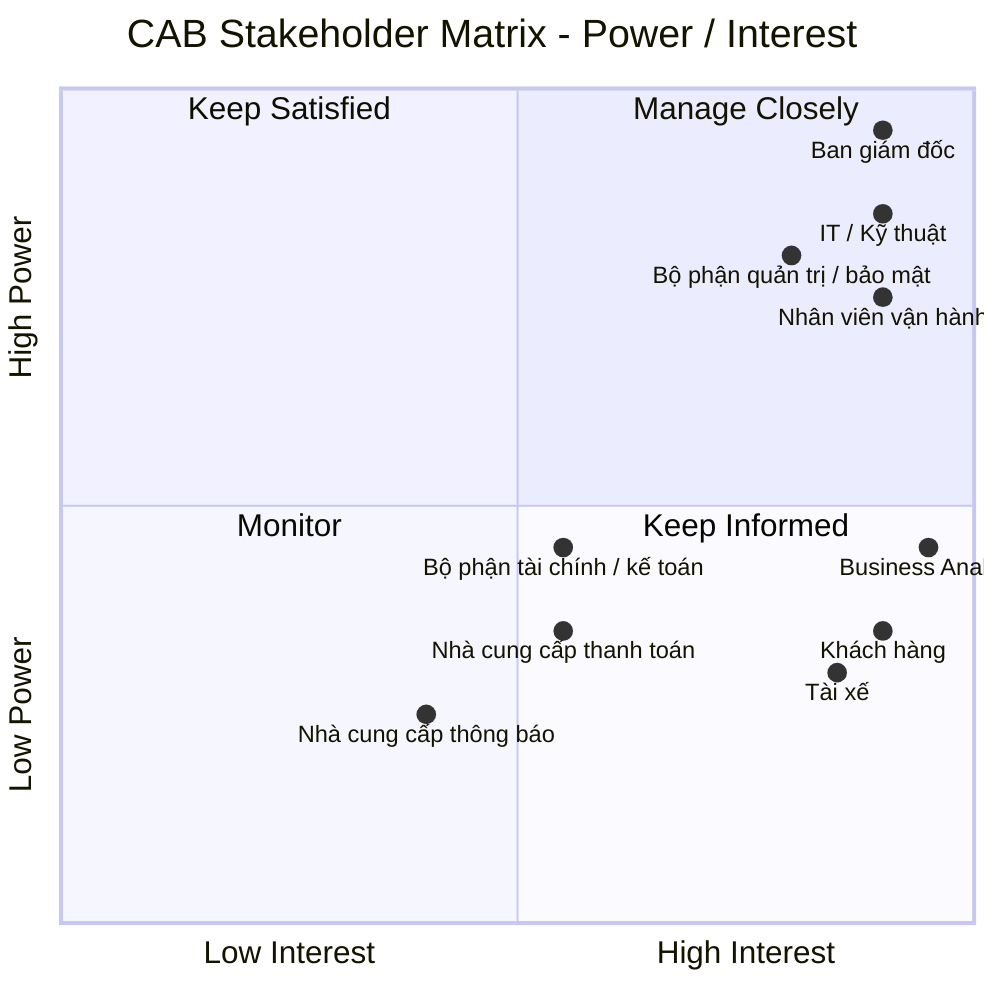
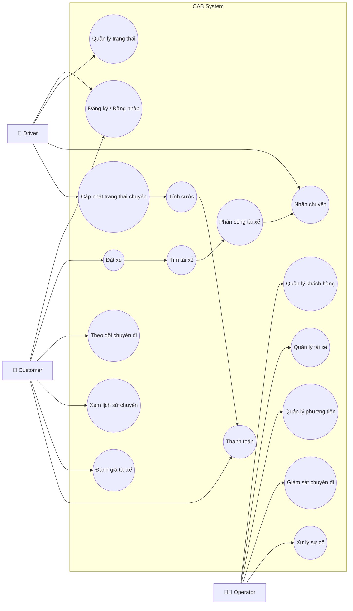

# Xây dựng hệ thống CAB phục vụ đặt xe trực tuyến

## Bước 1: Các vấn đề hiện tại cần giải quyết

- Phân công tài xế chủ yếu thực hiện thủ công
- Khách hàng khó theo dõi trạng thái chuyến đi
- Thông tin thanh toán chưa được quản lý tập trung
- Bộ phận vận hành gặp khó khăn khi muốn mở rộng hệ thống

## Bước 2: Stakeholder (Các bên liên quan)

| Stakeholder                        | Vai trò / Mối quan tâm                                 | Power      | Interest   |
| ---------------------------------- | ------------------------------------------------------ | ---------- | ---------- |
| **Ban giám đốc**                   | Quyết định chiến lược, ngân sách, định hướng hệ thống  | Cao        | Cao        |
| **Nhân viên vận hành**             | Quản lý tài xế, chuyến đi, xử lý sự cố                 | Cao        | Cao        |
| **Khách hàng**                     | Đặt xe, theo dõi chuyến, thanh toán, đánh giá          | Thấp       | Cao        |
| **Tài xế**                         | Nhận và thực hiện chuyến, cập nhật trạng thái/vị trí   | Thấp       | Cao        |
| **Bộ phận IT / Kỹ thuật**          | Xây dựng, vận hành, mở rộng và bảo trì hệ thống        | Cao        | Cao        |
| **Nhà cung cấp thanh toán**        | Xử lý giao dịch thanh toán điện tử                     | Trung bình | Trung bình |
| **Nhà cung cấp dịch vụ thông báo** | Cung cấp SMS, email, push notification,...             | Thấp       | Trung bình |
| **Business Analyst**               | Phân tích nghiệp vụ, làm rõ yêu cầu và kết nối các bên | Trung bình | Cao        |
| **Bộ phận tài chính / kế toán**    | Theo dõi doanh thu, giao dịch, báo cáo tài chính       | Trung bình | Trung bình |
| **Bộ phận quản trị / bảo mật**     | Kiểm soát quyền truy cập, bảo vệ dữ liệu, audit        | Cao        | Cao        |

## Stakeholder Matrix

## Bước 3: Mục tiêu

| ID       | Business Goal                                         | Ý nghĩa                                                                                                                                      |
| -------- | ----------------------------------------------------- | -------------------------------------------------------------------------------------------------------------------------------------------- |
| **BG01** | **Tự động hóa quy trình đặt và phân công xe**         | Giảm sự phụ thuộc vào nhân viên tổng đài và việc phân công tài xế thủ công.                                                                  |
| **BG02** | **Nâng cao chất lượng trải nghiệm khách hàng**        | Giúp khách hàng dễ đặt xe, theo dõi trạng thái chuyến, biết tài xế và thời gian dự kiến đến.                                                 |
| **BG03** | **Tối ưu hóa việc sử dụng tài xế**                    | Tự động tìm và ưu tiên tài xế phù hợp, gần khách hàng và đang sẵn sàng nhận chuyến.                                                          |
| **BG04** | **Quản lý tập trung hoạt động vận hành**              | Cung cấp cho nhân viên vận hành khả năng quản lý khách hàng, tài xế, phương tiện và chuyến đi trên một nền tảng.                             |
| **BG05** | **Tăng hiệu quả quản lý doanh thu và thanh toán**     | Chuẩn hóa việc tính cước, quản lý giao dịch và hỗ trợ nhiều phương thức thanh toán.                                                          |
| **BG06** | **Nâng cao khả năng giám sát và ra quyết định**       | Cung cấp dữ liệu và báo cáo về số chuyến, doanh thu, tỷ lệ hoàn thành, hủy chuyến và hiệu quả tài xế.                                        |
| **BG07** | **Đảm bảo hệ thống có khả năng mở rộng**              | Cho phép phục vụ số lượng lớn khách hàng/tài xế và mở rộng các thành phần khi nhu cầu tăng.                                                  |
| **BG08** | **Tăng tính linh hoạt trong phát triển sản phẩm**     | Cho phép bổ sung dịch vụ, phương thức thanh toán, kênh thông báo hoặc thay đổi thành phần kỹ thuật mà không phải xây dựng lại toàn hệ thống. |
| **BG09** | **Đảm bảo tính bảo mật và tuân thủ dữ liệu**          | Bảo vệ thông tin cá nhân, dữ liệu vị trí, giao dịch và kiểm soát các thao tác quản trị.                                                      |
| **BG10** | **Nâng cao độ tin cậy và tính sẵn sàng của hệ thống** | Đảm bảo lỗi ở một thành phần như thanh toán hoặc thông báo không làm toàn bộ hệ thống đặt xe ngừng hoạt động.                                |

## Bước 4: Xác định phạm vi cho 7 tuần xây dựng

| STT | Phạm vi | Chức năng chính |
|-----|---------|-----------------|
| 1 | Quản lý tài khoản | Đăng ký, đăng nhập, cập nhật thông tin cá nhân, phân quyền |
| 2 | Đặt xe | Nhập điểm đón, điểm đến, chọn loại xe và tạo yêu cầu đặt xe |
| 3 | Phân công tài xế | Tìm tài xế phù hợp, chấp nhận/từ chối chuyến, tìm tài xế khác khi bị từ chối |
| 4 | Quản lý chuyến đi | Cập nhật và theo dõi trạng thái chuyến, lưu lịch sử chuyến |
| 5 | Tính cước & thanh toán | Tính cước và hỗ trợ thanh toán tiền mặt |
| 6 | Quản lý vận hành | Quản lý khách hàng, tài xế, chuyến đi và xử lý các trường hợp bất thường |

## Bước 5: Chuyển yêu cầu thành business requirements

| ID | Business Requirement |
|----|-----------------------|
| BR-01 | Hỗ trợ khách hàng đăng ký, đăng nhập và tạo yêu cầu đặt xe. |
| BR-02 | Hỗ trợ khách hàng nhập điểm đón, điểm đến và lựa chọn loại xe. |
| BR-03 | Tự động tìm và phân công tài xế phù hợp cho yêu cầu đặt xe. |
| BR-04 | Cho phép tài xế nhận hoặc từ chối chuyến và tiếp tục tìm tài xế khác khi cần. |
| BR-05 | Quản lý và theo dõi trạng thái chuyến đi từ lúc tạo yêu cầu đến khi hoàn thành. |
| BR-06 | Tính toán cước và hỗ trợ thanh toán cho chuyến đi. |
| BR-07 | Cung cấp chức năng quản lý và giám sát chuyến đi cho nhân viên vận hành. |
| BR-08 | Đảm bảo hệ thống có khả năng hoạt động ổn định, bảo mật và có thể mở rộng trong tương lai. |

# Bước 6: Phân rã yêu cầu chức năng (Functional Requirements)

| BR | ID | Functional Requirement |
|----|----|-------------------------|
| BR-01 | FR-01 | Hệ thống cho phép khách hàng đăng ký tài khoản. |
| BR-01 | FR-02 | Hệ thống cho phép khách hàng đăng nhập vào hệ thống. |
| BR-01 | FR-03 | Hệ thống cho phép khách hàng đăng xuất khỏi hệ thống. |
| BR-01 | FR-04 | Hệ thống cho phép khách hàng cập nhật thông tin cá nhân. |
| BR-01 | FR-05 | Hệ thống cho phép khách hàng tạo yêu cầu đặt xe. |
| BR-02 | FR-06 | Hệ thống cho phép khách hàng nhập điểm đón. |
| BR-02 | FR-07 | Hệ thống cho phép khách hàng nhập điểm đến. |
| BR-02 | FR-08 | Hệ thống cho phép khách hàng lựa chọn loại xe. |
| BR-02 | FR-09 | Hệ thống hiển thị thông tin chuyến trước khi khách hàng xác nhận đặt xe. |
| BR-03 | FR-10 | Hệ thống xác định các tài xế đang sẵn sàng nhận chuyến. |
| BR-03 | FR-11 | Hệ thống xác định tài xế phù hợp dựa trên vị trí và loại xe. |
| BR-03 | FR-12 | Hệ thống ưu tiên tài xế phù hợp và gần khách hàng. |
| BR-03 | FR-13 | Hệ thống gửi yêu cầu chuyến đến tài xế được lựa chọn. |
| BR-03 | FR-14 | Hệ thống ghi nhận tài xế được phân công cho chuyến. |
| BR-04 | FR-15 | Hệ thống thông báo yêu cầu chuyến mới cho tài xế. |
| BR-04 | FR-16 | Hệ thống cho phép tài xế chấp nhận chuyến. |
| BR-04 | FR-17 | Hệ thống cho phép tài xế từ chối chuyến. |
| BR-04 | FR-18 | Hệ thống xác định thời gian phản hồi của tài xế. |
| BR-04 | FR-19 | Hệ thống tiếp tục tìm tài xế khác khi tài xế từ chối hoặc không phản hồi. |
| BR-04 | FR-20 | Hệ thống thông báo cho khách hàng khi không tìm được tài xế. |
| BR-05 | FR-21 | Hệ thống tạo và quản lý trạng thái của chuyến đi. |
| BR-05 | FR-22 | Hệ thống cho phép tài xế cập nhật trạng thái đã đến điểm đón. |
| BR-05 | FR-23 | Hệ thống cho phép tài xế cập nhật trạng thái đã đón khách. |
| BR-05 | FR-24 | Hệ thống cho phép tài xế cập nhật trạng thái đang di chuyển. |
| BR-05 | FR-25 | Hệ thống cho phép tài xế cập nhật trạng thái hoàn thành chuyến. |
| BR-05 | FR-26 | Hệ thống cho phép khách hàng theo dõi trạng thái chuyến đi. |
| BR-05 | FR-27 | Hệ thống lưu trữ lịch sử các chuyến đi. |
| BR-06 | FR-28 | Hệ thống xác định số tiền khách hàng phải thanh toán. |
| BR-06 | FR-29 | Hệ thống tính cước dựa trên loại dịch vụ và thông tin chuyến đi. |
| BR-06 | FR-30 | Hệ thống cho phép khách hàng lựa chọn phương thức thanh toán. |
| BR-06 | FR-31 | Hệ thống ghi nhận kết quả thanh toán. |
| BR-06 | FR-32 | Hệ thống thông báo cho khách hàng khi thanh toán thất bại. |
| BR-07 | FR-33 | Hệ thống cho phép nhân viên vận hành quản lý thông tin khách hàng. |
| BR-07 | FR-34 | Hệ thống cho phép nhân viên vận hành quản lý thông tin tài xế. |
| BR-07 | FR-35 | Hệ thống cho phép nhân viên vận hành quản lý thông tin phương tiện. |
| BR-07 | FR-36 | Hệ thống cho phép nhân viên vận hành xem các chuyến đang diễn ra. |
| BR-07 | FR-37 | Hệ thống cho phép nhân viên vận hành xem trạng thái tài xế. |
| BR-07 | FR-38 | Hệ thống cho phép nhân viên vận hành xử lý các chuyến gặp sự cố. |
| BR-07 | FR-39 | Hệ thống cho phép nhân viên vận hành tra cứu lịch sử chuyến đi và giao dịch. |
| BR-08 | FR-40 | Hệ thống xác thực người dùng trước khi sử dụng các chức năng yêu cầu tài khoản. |
| BR-08 | FR-41 | Hệ thống kiểm soát quyền truy cập các chức năng quản trị theo vai trò. |
| BR-08 | FR-42 | Hệ thống ghi nhận các thao tác quản trị quan trọng. |

# Bước 7: Usecase Diagram

# Bước 8: Đặc tả usecase

# Bước 9: Phân tích quy trình nghiệp vụ (Businiess Process)

# Bước 10: Phân tích quy tắc nghiệp vụ (Business Rules)