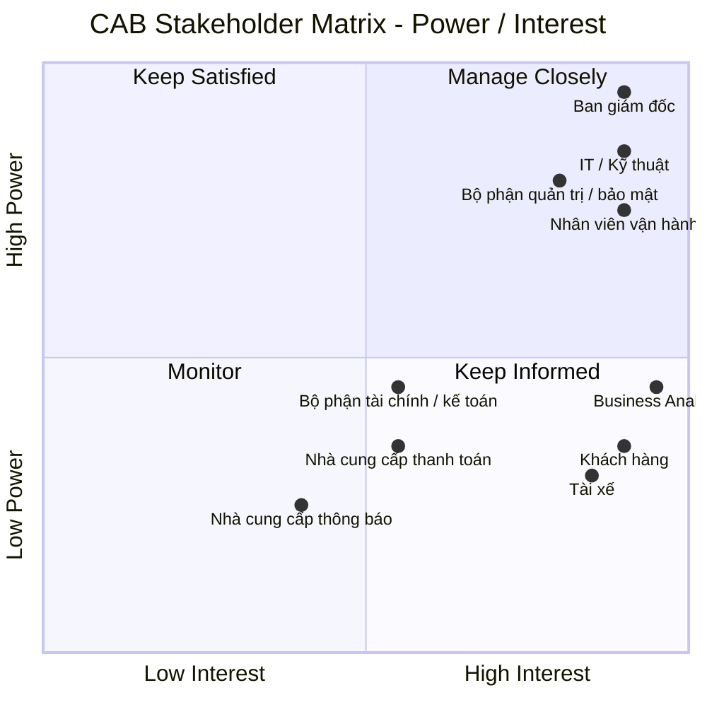
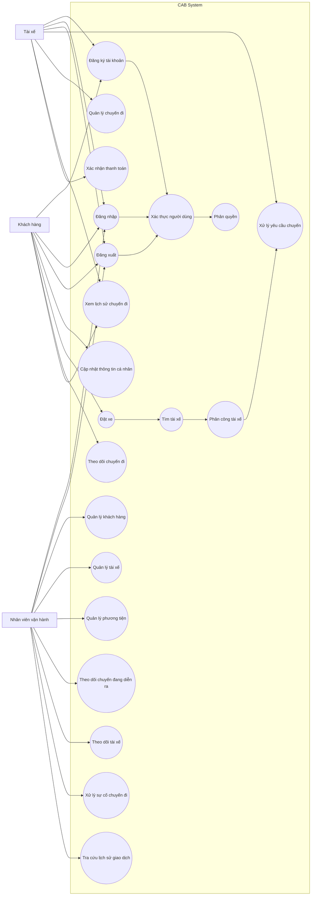

# Xây dựng hệ thống CAB phục vụ đặt xe trực tuyến

## Bước 1: Các vấn đề hiện tại cần giải quyết

- Phân công tài xế chủ yếu thực hiện thủ công
- Khách hàng khó theo dõi trạng thái chuyến đi
- Thông tin thanh toán chưa được quản lý tập trung
- Bộ phận vận hành gặp khó khăn khi muốn mở rộng hệ thống

## Bước 2: Stakeholder (Các bên liên quan)

| Stakeholder                        | Vai trò / Mối quan tâm                                 | Power      | Interest   |
| ---------------------------------- | ------------------------------------------------------ | ---------- | ---------- |
| **Ban giám đốc**                   | Quyết định chiến lược, ngân sách, định hướng hệ thống  | Cao        | Cao        |
| **Nhân viên vận hành**             | Quản lý tài xế, chuyến đi, xử lý sự cố                 | Cao        | Cao        |
| **Khách hàng**                     | Đặt xe, theo dõi chuyến, thanh toán, đánh giá          | Thấp       | Cao        |
| **Tài xế**                         | Nhận và thực hiện chuyến, cập nhật trạng thái/vị trí   | Thấp       | Cao        |
| **Bộ phận IT / Kỹ thuật**          | Xây dựng, vận hành, mở rộng và bảo trì hệ thống        | Cao        | Cao        |
| **Nhà cung cấp thanh toán**        | Xử lý giao dịch thanh toán điện tử                     | Trung bình | Trung bình |
| **Nhà cung cấp dịch vụ thông báo** | Cung cấp SMS, email, push notification,...             | Thấp       | Trung bình |
| **Business Analyst**               | Phân tích nghiệp vụ, làm rõ yêu cầu và kết nối các bên | Trung bình | Cao        |
| **Bộ phận tài chính / kế toán**    | Theo dõi doanh thu, giao dịch, báo cáo tài chính       | Trung bình | Trung bình |
| **Bộ phận quản trị / bảo mật**     | Kiểm soát quyền truy cập, bảo vệ dữ liệu, audit        | Cao        | Cao        |

## Stakeholder Matrix

## Bước 3: Mục tiêu

| ID       | Business Goal                                         | Ý nghĩa                                                                                                                                      |
| -------- | ----------------------------------------------------- | -------------------------------------------------------------------------------------------------------------------------------------------- |
| **BG01** | **Tự động hóa quy trình đặt và phân công xe**         | Giảm sự phụ thuộc vào nhân viên tổng đài và việc phân công tài xế thủ công.                                                                  |
| **BG02** | **Nâng cao chất lượng trải nghiệm khách hàng**        | Giúp khách hàng dễ đặt xe, theo dõi trạng thái chuyến, biết tài xế và thời gian dự kiến đến.                                                 |
| **BG03** | **Tối ưu hóa việc sử dụng tài xế**                    | Tự động tìm và ưu tiên tài xế phù hợp, gần khách hàng và đang sẵn sàng nhận chuyến.                                                          |
| **BG04** | **Quản lý tập trung hoạt động vận hành**              | Cung cấp cho nhân viên vận hành khả năng quản lý khách hàng, tài xế, phương tiện và chuyến đi trên một nền tảng.                             |
| **BG05** | **Tăng hiệu quả quản lý doanh thu và thanh toán**     | Chuẩn hóa việc tính cước, quản lý giao dịch và hỗ trợ nhiều phương thức thanh toán.                                                          |
| **BG06** | **Nâng cao khả năng giám sát và ra quyết định**       | Cung cấp dữ liệu và báo cáo về số chuyến, doanh thu, tỷ lệ hoàn thành, hủy chuyến và hiệu quả tài xế.                                        |
| **BG07** | **Đảm bảo hệ thống có khả năng mở rộng**              | Cho phép phục vụ số lượng lớn khách hàng/tài xế và mở rộng các thành phần khi nhu cầu tăng.                                                  |
| **BG08** | **Tăng tính linh hoạt trong phát triển sản phẩm**     | Cho phép bổ sung dịch vụ, phương thức thanh toán, kênh thông báo hoặc thay đổi thành phần kỹ thuật mà không phải xây dựng lại toàn hệ thống. |
| **BG09** | **Đảm bảo tính bảo mật và tuân thủ dữ liệu**          | Bảo vệ thông tin cá nhân, dữ liệu vị trí, giao dịch và kiểm soát các thao tác quản trị.                                                      |
| **BG10** | **Nâng cao độ tin cậy và tính sẵn sàng của hệ thống** | Đảm bảo lỗi ở một thành phần như thanh toán hoặc thông báo không làm toàn bộ hệ thống đặt xe ngừng hoạt động.                                |

## Bước 4: Xác định phạm vi cho 7 tuần xây dựng

| STT | Phạm vi | Chức năng chính |
|-----|---------|-----------------|
| 1 | Quản lý tài khoản | Đăng ký, đăng nhập, cập nhật thông tin cá nhân, phân quyền |
| 2 | Đặt xe | Nhập điểm đón, điểm đến, chọn loại xe và tạo yêu cầu đặt xe |
| 3 | Phân công tài xế | Tìm tài xế phù hợp, chấp nhận/từ chối chuyến, tìm tài xế khác khi bị từ chối |
| 4 | Quản lý chuyến đi | Cập nhật và theo dõi trạng thái chuyến, lưu lịch sử chuyến |
| 5 | Tính cước | Tính cước và hỗ trợ thanh toán tiền mặt |
| 6 | Quản lý vận hành | Quản lý khách hàng, tài xế, chuyến đi và xử lý các trường hợp bất thường |

## Bước 5: Chuyển yêu cầu thành business requirements

| ID | Business Requirement |
|----|-----------------------|
| BR-01 | Hỗ trợ khách hàng đăng ký, đăng nhập và tạo yêu cầu đặt xe. |
| BR-02 | Hỗ trợ khách hàng nhập điểm đón, điểm đến và lựa chọn loại xe. |
| BR-03 | Tự động tìm và phân công tài xế phù hợp cho yêu cầu đặt xe. |
| BR-04 | Cho phép tài xế nhận hoặc từ chối chuyến và tiếp tục tìm tài xế khác khi cần. |
| BR-05 | Quản lý và theo dõi trạng thái chuyến đi từ lúc tạo yêu cầu đến khi hoàn thành. |
| BR-06 | Tính toán cước và hỗ trợ thanh toán cho chuyến đi. |
| BR-07 | Cung cấp chức năng quản lý và giám sát chuyến đi cho nhân viên vận hành. |
| BR-08 | Đảm bảo hệ thống có khả năng hoạt động ổn định, bảo mật và có thể mở rộng trong tương lai. |

# Bước 6: Phân rã yêu cầu chức năng (Functional Requirements)

| BR | ID | Chức năng | Mô tả | Role |
| :--- | :--- | :--- | :--- | :--- |
| BR-01 | FR-01 | **Đăng ký tài khoản** | Người dùng nhập thông tin cần thiết để tạo tài khoản mới và đăng ký sử dụng hệ thống. | Khách hàng, Tài xế |
| BR-01 | FR-02 | **Đăng nhập** | Người dùng cung cấp thông tin xác thực để truy cập vào hệ thống. | Khách hàng, Tài xế, Nhân viên vận hành |
| BR-01 | FR-03 | **Đăng xuất** | Người dùng kết thúc phiên đăng nhập hiện tại và thoát khỏi hệ thống. | Khách hàng, Tài xế, Nhân viên vận hành |
| BR-01 | FR-04 | **Cập nhật thông tin cá nhân** | Người dùng xem và cập nhật thông tin cá nhân của tài khoản. | Khách hàng |
| BR-01 | FR-05 | **Đặt xe** | Khách hàng nhập điểm đón, điểm đến, lựa chọn loại xe, xem thông tin chuyến và xác nhận yêu cầu đặt xe. | Khách hàng |
| BR-03 | FR-06 | **Tìm tài xế** | Hệ thống xác định các tài xế đang sẵn sàng và tìm tài xế phù hợp dựa trên vị trí và loại xe. | Hệ thống |
| BR-03 | FR-07 | **Phân công tài xế** | Hệ thống ưu tiên và gửi yêu cầu chuyến đến tài xế phù hợp. Khi tài xế từ chối hoặc không phản hồi, hệ thống tiếp tục tìm tài xế khác. Nếu không tìm được tài xế, hệ thống thông báo cho khách hàng. | Hệ thống |
| BR-04 | FR-08 | **Xử lý yêu cầu chuyến** | Tài xế nhận thông báo yêu cầu chuyến mới và lựa chọn chấp nhận hoặc từ chối chuyến. | Tài xế |
| BR-05 | FR-09 | **Quản lý chuyến đi** | Hệ thống tạo và quản lý trạng thái chuyến; tài xế cập nhật trạng thái từ đã đến điểm đón, đã đón khách, đang di chuyển đến hoàn thành chuyến. | Tài xế, Hệ thống |
| BR-05 | FR-10 | **Theo dõi chuyến đi** | Khách hàng theo dõi trạng thái hiện tại của chuyến đi. | Khách hàng |
| BR-05 | FR-11 | **Xem lịch sử chuyến đi** | Người dùng tra cứu các chuyến đi đã hoàn thành và xem thông tin của từng chuyến, bao gồm thông tin cước phí. | Khách hàng, Tài xế, Nhân viên vận hành |
| BR-06 | FR-12 | **Xác nhận thanh toán** | Tài xế xác nhận đã nhận tiền từ khách hàng; hệ thống ghi nhận chuyến đi ở trạng thái đã thanh toán. | Tài xế, Hệ thống |
| BR-07 | FR-13 | **Quản lý khách hàng** | Nhân viên vận hành xem và quản lý thông tin khách hàng. | Nhân viên vận hành |
| BR-07 | FR-14 | **Quản lý tài xế** | Nhân viên vận hành xem và quản lý thông tin tài xế. | Nhân viên vận hành |
| BR-07 | FR-15 | **Quản lý phương tiện** | Nhân viên vận hành xem và quản lý thông tin phương tiện. | Nhân viên vận hành |
| BR-07 | FR-16 | **Theo dõi chuyến đang diễn ra** | Nhân viên vận hành xem các chuyến hiện đang được thực hiện trong hệ thống. | Nhân viên vận hành |
| BR-07 | FR-17 | **Theo dõi tài xế** | Nhân viên vận hành xem trạng thái của các tài xế. | Nhân viên vận hành |
| BR-07 | FR-18 | **Xử lý sự cố chuyến đi** | Nhân viên vận hành tiếp nhận và xử lý các chuyến đi gặp sự cố. | Nhân viên vận hành |
| BR-07 | FR-19 | **Tra cứu lịch sử giao dịch** | Nhân viên vận hành tra cứu thông tin các giao dịch thanh toán trong hệ thống. | Nhân viên vận hành |
| BR-08 | FR-20 | **Xác thực người dùng** | Hệ thống xác thực người dùng trước khi cho phép sử dụng các chức năng yêu cầu tài khoản. | Hệ thống |
| BR-08 | FR-21 | **Phân quyền** | Hệ thống kiểm soát quyền truy cập các chức năng dựa trên vai trò của người dùng. | Hệ thống |

# Bước 7: Usecase Diagram

# Bước 8: Đặc tả usecase

## 1. 

# Bước 9: Phân tích quy trình nghiệp vụ (Businiess Process)

# Bước 10: Phân tích quy tắc nghiệp vụ (Business Rules)