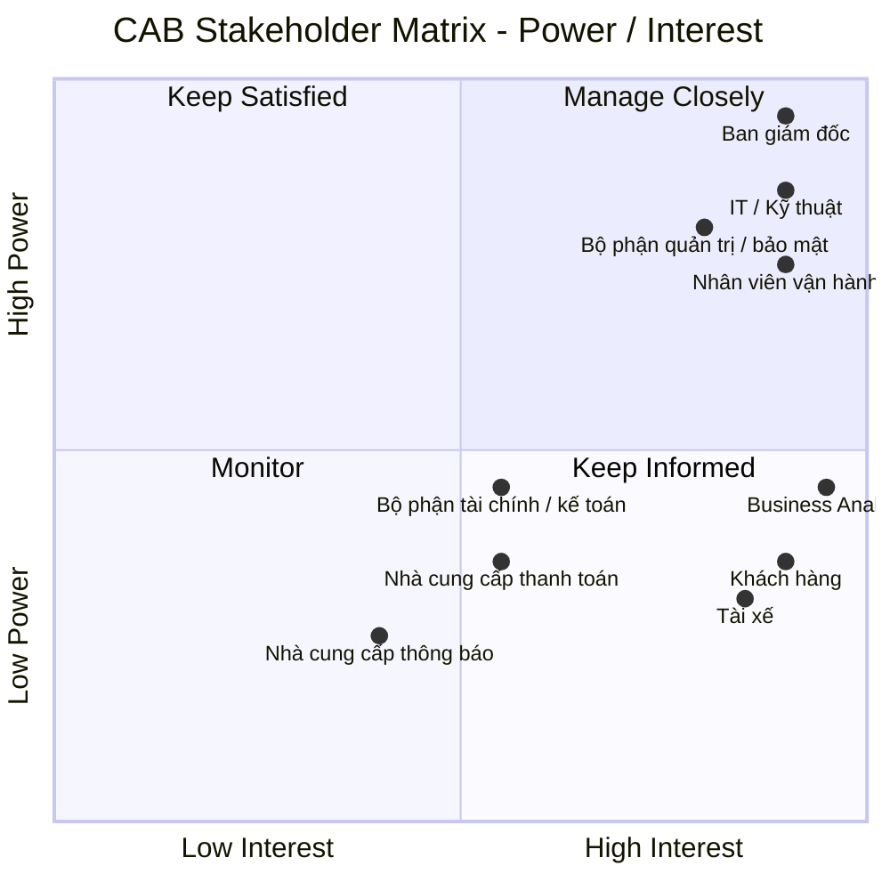

# Xây dựng hệ thống CAB phục vụ đặt xe trực tuyến

## Các vấn đề hiện tại cần giải quyết

- Phân công tài xế chủ yếu thực hiện thủ công
- Khách hàng khó theo dõi trạng thái chuyến đi
- Thông tin thanh toán chưa được quản lý tập trung
- Bộ phận vận hành gặp khó khăn khi muốn mở rộng hệ thống

## StakeHolders (Các bên liên quan)

| Stakeholder                        | Vai trò / Mối quan tâm                                 | Power      | Interest   |
| ---------------------------------- | ------------------------------------------------------ | ---------- | ---------- |
| **Ban giám đốc**                   | Quyết định chiến lược, ngân sách, định hướng hệ thống  | Cao        | Cao        |
| **Nhân viên vận hành**             | Quản lý tài xế, chuyến đi, xử lý sự cố                 | Cao        | Cao        |
| **Khách hàng**                     | Đặt xe, theo dõi chuyến, thanh toán, đánh giá          | Thấp       | Cao        |
| **Tài xế**                         | Nhận và thực hiện chuyến, cập nhật trạng thái/vị trí   | Thấp       | Cao        |
| **Bộ phận IT / Kỹ thuật**          | Xây dựng, vận hành, mở rộng và bảo trì hệ thống        | Cao        | Cao        |
| **Nhà cung cấp thanh toán**        | Xử lý giao dịch thanh toán điện tử                     | Trung bình | Trung bình |
| **Nhà cung cấp dịch vụ thông báo** | Cung cấp SMS, email, push notification,...             | Thấp       | Trung bình |
| **Business Analyst**               | Phân tích nghiệp vụ, làm rõ yêu cầu và kết nối các bên | Trung bình | Cao        |
| **Bộ phận tài chính / kế toán**    | Theo dõi doanh thu, giao dịch, báo cáo tài chính       | Trung bình | Trung bình |
| **Bộ phận quản trị / bảo mật**     | Kiểm soát quyền truy cập, bảo vệ dữ liệu, audit        | Cao        | Cao        |

## Stakeholder Matrix

