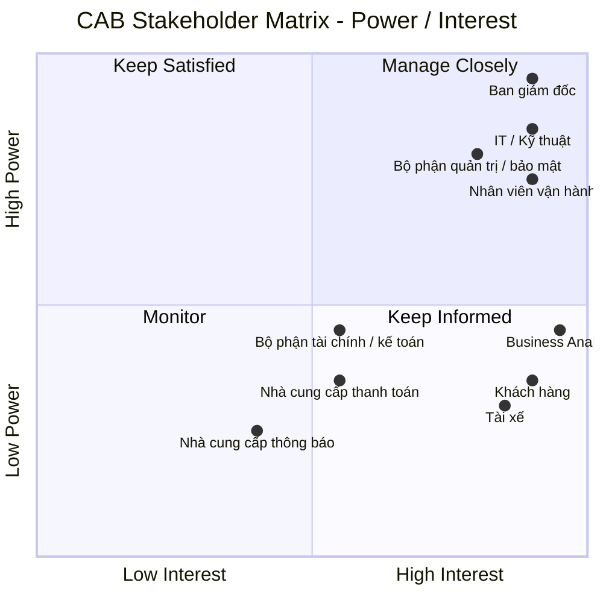

# Xây dựng hệ thống CAB phục vụ đặt xe trực tuyến

## Bước 1: Các vấn đề hiện tại cần giải quyết

- Phân công tài xế chủ yếu thực hiện thủ công.
- Khách hàng khó theo dõi trạng thái chuyến đi.
- Thông tin thanh toán chưa được quản lý tập trung.
- Bộ phận vận hành gặp khó khăn khi muốn mở rộng hệ thống.

---

## Bước 2: Stakeholder (Các bên liên quan)

| Stakeholder                        | Vai trò / Mối quan tâm                                 | Power      | Interest   |
| ---------------------------------- | ------------------------------------------------------ | ---------- | ---------- |
| **Ban giám đốc**                   | Quyết định chiến lược, ngân sách, định hướng hệ thống  | Cao        | Cao        |
| **Nhân viên vận hành**             | Quản lý tài xế, chuyến đi, xử lý sự cố                 | Cao        | Cao        |
| **Khách hàng**                     | Đặt xe, theo dõi chuyến, thanh toán, đánh giá          | Thấp       | Cao        |
| **Tài xế**                         | Nhận và thực hiện chuyến, cập nhật trạng thái/vị trí   | Thấp       | Cao        |
| **Bộ phận IT / Kỹ thuật**          | Xây dựng, vận hành, mở rộng và bảo trì hệ thống        | Cao        | Cao        |
| **Nhà cung cấp thanh toán**        | Xử lý giao dịch thanh toán điện tử                     | Trung bình | Trung bình |
| **Nhà cung cấp dịch vụ thông báo** | Cung cấp SMS, email, push notification,...             | Thấp       | Trung bình |
| **Business Analyst**               | Phân tích nghiệp vụ, làm rõ yêu cầu và kết nối các bên | Trung bình | Cao        |
| **Bộ phận tài chính / kế toán**    | Theo dõi doanh thu, giao dịch, báo cáo tài chính       | Trung bình | Trung bình |
| **Bộ phận quản trị / bảo mật**     | Kiểm soát quyền truy cập, bảo vệ dữ liệu, audit        | Cao        | Cao        |

### Stakeholder Matrix

## Bước 3: Business Goal

| ID       | Business Goal                                         | Ý nghĩa                                                                                                                                      |
| -------- | ----------------------------------------------------- | -------------------------------------------------------------------------------------------------------------------------------------------- |
| **BG01** | **Tự động hóa quy trình đặt và phân công xe**         | Giảm sự phụ thuộc vào nhân viên tổng đài và việc phân công tài xế thủ công.                                                                  |
| **BG02** | **Nâng cao chất lượng trải nghiệm khách hàng**        | Giúp khách hàng dễ đặt xe, theo dõi trạng thái chuyến, biết tài xế và thời gian dự kiến đến.                                                 |
| **BG03** | **Tối ưu hóa việc sử dụng tài xế**                    | Tự động tìm và ưu tiên tài xế phù hợp, gần khách hàng và đang sẵn sàng nhận chuyến.                                                          |
| **BG04** | **Quản lý tập trung hoạt động vận hành**              | Cung cấp cho nhân viên vận hành khả năng quản lý khách hàng, tài xế, phương tiện và chuyến đi trên một nền tảng.                             |
| **BG05** | **Tăng hiệu quả quản lý doanh thu và thanh toán**     | Chuẩn hóa việc tính cước, quản lý giao dịch và hỗ trợ nhiều phương thức thanh toán.                                                          |
| **BG06** | **Nâng cao khả năng giám sát và ra quyết định**       | Cung cấp dữ liệu và báo cáo về số chuyến, doanh thu, tỷ lệ hoàn thành, hủy chuyến và hiệu quả tài xế.                                        |
| **BG07** | **Đảm bảo hệ thống có khả năng mở rộng**              | Cho phép phục vụ số lượng lớn khách hàng/tài xế và mở rộng các thành phần khi nhu cầu tăng.                                                  |
| **BG08** | **Tăng tính linh hoạt trong phát triển sản phẩm**     | Cho phép bổ sung dịch vụ, phương thức thanh toán, kênh thông báo hoặc thay đổi thành phần kỹ thuật mà không phải xây dựng lại toàn hệ thống. |
| **BG09** | **Đảm bảo tính bảo mật và tuân thủ dữ liệu**          | Bảo vệ thông tin cá nhân, dữ liệu vị trí, giao dịch và kiểm soát các thao tác quản trị.                                                      |
| **BG10** | **Nâng cao độ tin cậy và tính sẵn sàng của hệ thống** | Đảm bảo lỗi ở một thành phần như thanh toán hoặc thông báo không làm toàn bộ hệ thống đặt xe ngừng hoạt động.                                |

## Bước 4: Functional Requirements

| STT | Phạm vi                | Chức năng chính                                                                                  |
| --- | ---------------------- | ------------------------------------------------------------------------------------------------ |
| 1   | Quản lý tài khoản      | Đăng ký, đăng nhập, cập nhật thông tin cá nhân, phân quyền                                       |
| 2   | Đặt xe                 | Nhập điểm đón, điểm đến, chọn loại xe và tạo yêu cầu đặt xe                                      |
| 3   | Phân công tài xế       | Tìm tài xế phù hợp, gửi yêu cầu chuyến, chấp nhận/từ chối chuyến, tìm tài xế khác khi bị từ chối |
| 4   | Quản lý chuyến đi      | Cập nhật và theo dõi trạng thái chuyến, lưu lịch sử chuyến                                       |
| 5   | Tính cước & thanh toán | Tính cước và hỗ trợ thanh toán                                                                   |
| 6   | Quản lý vận hành       | Quản lý khách hàng, tài xế, phương tiện, chuyến đi và xử lý các trường hợp bất thường            |
| 7   | Đánh giá tài xế        | Cho phép khách hàng đánh giá tài xế sau khi chuyến đi hoàn thành                                 |

## Bước 5

| ID        | Business Requirement                                                                     |
| --------- | ---------------------------------------------------------------------------------------- |
| **BR-01** | Hỗ trợ khách hàng đăng ký, đăng nhập và quản lý tài khoản.                               |
| **BR-02** | Hỗ trợ khách hàng tạo yêu cầu đặt xe với điểm đón, điểm đến và loại xe.                  |
| **BR-03** | Tự động tìm và phân công tài xế phù hợp cho yêu cầu đặt xe.                              |
| **BR-04** | Cho phép tài xế nhận hoặc từ chối chuyến và tiếp tục tìm tài xế khác khi cần.            |
| **BR-05** | Quản lý và theo dõi trạng thái chuyến đi từ lúc tạo yêu cầu đến khi hoàn thành hoặc hủy. |
| **BR-06** | Tính cước và quản lý thanh toán cho chuyến đi.                                           |
| **BR-07** | Cung cấp chức năng quản lý và giám sát hoạt động cho nhân viên vận hành.                 |
| **BR-08** | Cho phép khách hàng đánh giá tài xế sau khi chuyến đi hoàn thành.                        |
| **BR-09** | Đảm bảo hệ thống có khả năng phân quyền, bảo mật và ghi nhận các thao tác quan trọng.    |

| BR    | ID    | Functional Requirement                                                                             |
| ----- | ----- | -------------------------------------------------------------------------------------------------- |
| BR-01 | FR-01 | Hệ thống cho phép người dùng đăng ký, đăng nhập và đăng xuất.                                      |
| BR-01 | FR-02 | Hệ thống cho phép người dùng xem và cập nhật thông tin cá nhân.                                    |
| BR-01 | FR-03 | Hệ thống xác thực người dùng và kiểm soát quyền truy cập theo vai trò.                             |
| BR-02 | FR-04 | Hệ thống cho phép khách hàng nhập điểm đón và điểm đến.                                            |
| BR-02 | FR-05 | Hệ thống cho phép khách hàng lựa chọn loại xe và tạo yêu cầu đặt xe.                               |
| BR-02 | FR-06 | Hệ thống hiển thị thông tin chuyến để khách hàng xác nhận trước khi đặt.                           |
| BR-03 | FR-07 | Hệ thống xác định tài xế đang sẵn sàng và phù hợp với yêu cầu chuyến.                              |
| BR-03 | FR-08 | Hệ thống ưu tiên tài xế phù hợp và gần khách hàng.                                                 |
| BR-03 | FR-09 | Hệ thống gửi yêu cầu chuyến và ghi nhận tài xế được phân công.                                     |
| BR-04 | FR-10 | Hệ thống cho phép tài xế nhận hoặc từ chối yêu cầu chuyến trong thời gian quy định.                |
| BR-04 | FR-11 | Hệ thống tiếp tục tìm tài xế khác khi tài xế từ chối hoặc không phản hồi.                          |
| BR-04 | FR-12 | Hệ thống thông báo cho khách hàng khi không tìm được tài xế.                                       |
| BR-05 | FR-13 | Hệ thống quản lý trạng thái chuyến từ khi tạo yêu cầu đến khi hoàn thành hoặc hủy.                 |
| BR-05 | FR-14 | Hệ thống cho phép tài xế cập nhật trạng thái trong quá trình thực hiện chuyến.                     |
| BR-05 | FR-15 | Hệ thống cho phép khách hàng theo dõi trạng thái và xem lịch sử chuyến đi.                         |
| BR-05 | FR-16 | Hệ thống cho phép khách hàng hủy chuyến theo điều kiện nghiệp vụ.                                  |
| BR-06 | FR-17 | Hệ thống tính cước dựa trên loại xe và thông tin chuyến đi.                                        |
| BR-06 | FR-18 | Hệ thống cho phép khách hàng lựa chọn phương thức thanh toán và ghi nhận kết quả giao dịch.        |
| BR-07 | FR-19 | Hệ thống cho phép nhân viên vận hành quản lý khách hàng, tài xế và phương tiện.                    |
| BR-07 | FR-20 | Hệ thống cho phép nhân viên vận hành giám sát chuyến đi, trạng thái tài xế và tra cứu lịch sử.     |
| BR-07 | FR-21 | Hệ thống cho phép nhân viên vận hành xử lý các chuyến gặp sự cố.                                   |
| BR-08 | FR-22 | Hệ thống cho phép khách hàng đánh giá tài xế sau khi chuyến đi hoàn thành và lưu kết quả đánh giá. |
| BR-09 | FR-23 | Hệ thống ghi nhận các thao tác quản trị quan trọng và kiểm soát quyền truy cập.                    |

