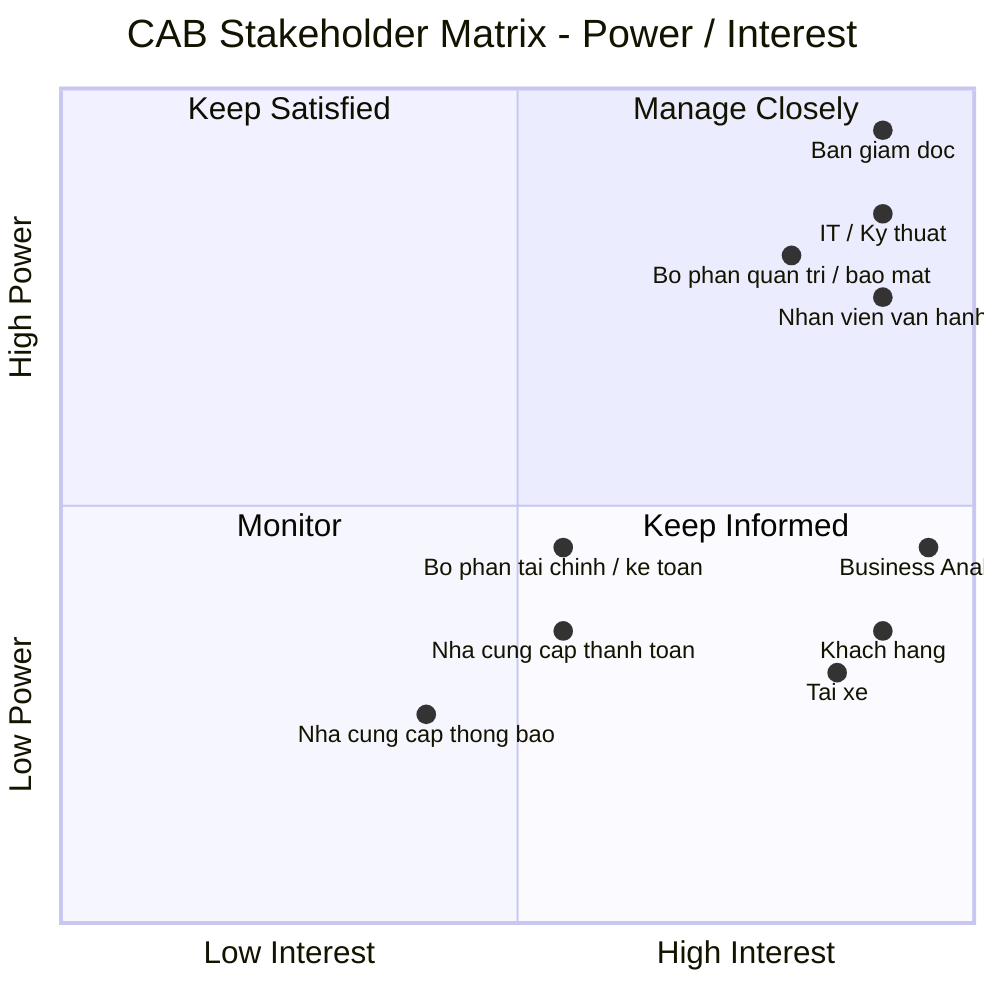
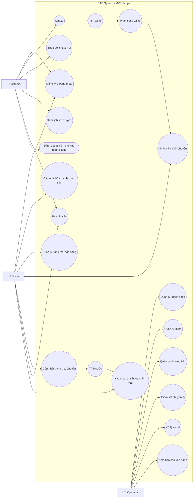
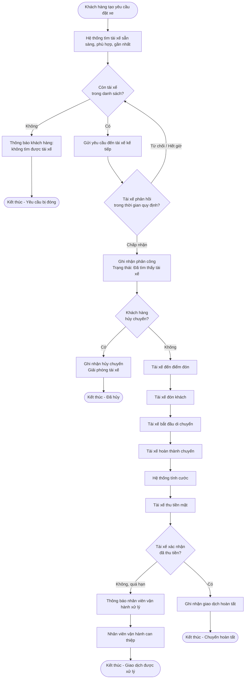

# Đặc tả Hệ thống CAB — Đặt xe trực tuyến

## Bước 1: Các vấn đề hiện tại cần giải quyết

- Phân công tài xế chủ yếu thực hiện thủ công
- Khách hàng khó theo dõi trạng thái chuyến đi
- Thông tin thanh toán chưa được quản lý tập trung
- Bộ phận vận hành gặp khó khăn khi muốn mở rộng hệ thống

---

## Bước 2: Stakeholder (Các bên liên quan)

| Stakeholder | Vai trò / Mối quan tâm | Power | Interest |
| --- | --- | --- | --- |
| **Ban giám đốc** | Quyết định chiến lược, ngân sách, định hướng hệ thống | Cao | Cao |
| **Nhân viên vận hành** | Quản lý tài xế, chuyến đi, xử lý sự cố | Cao | Cao |
| **Khách hàng** | Đặt xe, theo dõi chuyến, thanh toán, đánh giá | Thấp | Cao |
| **Tài xế** | Nhận và thực hiện chuyến, cập nhật trạng thái/vị trí | Thấp | Cao |
| **Bộ phận IT / Kỹ thuật** | Xây dựng, vận hành, mở rộng và bảo trì hệ thống | Cao | Cao |
| **Nhà cung cấp thanh toán** | Xử lý giao dịch thanh toán điện tử (giai đoạn sau) | Trung bình | Trung bình |
| **Nhà cung cấp dịch vụ thông báo** | Cung cấp SMS, email, push notification,... | Thấp | Trung bình |
| **Business Analyst** | Phân tích nghiệp vụ, làm rõ yêu cầu và kết nối các bên | Trung bình | Cao |
| **Bộ phận tài chính / kế toán** | Theo dõi doanh thu, giao dịch, báo cáo tài chính | Trung bình | Trung bình |
| **Bộ phận quản trị / bảo mật** | Kiểm soát quyền truy cập, bảo vệ dữ liệu, audit | Cao | Cao |

### Stakeholder Matrix

---

## Bước 3: Mục tiêu

| ID | Business Goal | Ý nghĩa |
| --- | --- | --- |
| **BG01** | Tự động hóa quy trình đặt và phân công xe | Giảm sự phụ thuộc vào nhân viên tổng đài và việc phân công tài xế thủ công. |
| **BG02** | Nâng cao chất lượng trải nghiệm khách hàng | Giúp khách hàng dễ đặt xe, theo dõi trạng thái chuyến, biết tài xế và thời gian dự kiến đến. |
| **BG03** | Tối ưu hóa việc sử dụng tài xế | Tự động tìm và ưu tiên tài xế phù hợp, gần khách hàng và đang sẵn sàng nhận chuyến. |
| **BG04** | Quản lý tập trung hoạt động vận hành | Cung cấp cho nhân viên vận hành khả năng quản lý khách hàng, tài xế, phương tiện và chuyến đi trên một nền tảng. |
| **BG05** | Tăng hiệu quả quản lý doanh thu và thanh toán | Chuẩn hóa việc tính cước, quản lý giao dịch và hỗ trợ nhiều phương thức thanh toán. |
| **BG06** | Nâng cao khả năng giám sát và ra quyết định | Cung cấp dữ liệu và báo cáo về số chuyến, doanh thu, tỷ lệ hoàn thành, hủy chuyến và hiệu quả tài xế. |
| **BG07** | Đảm bảo hệ thống có khả năng mở rộng | Cho phép phục vụ số lượng lớn khách hàng/tài xế và mở rộng các thành phần khi nhu cầu tăng. |
| **BG08** | Tăng tính linh hoạt trong phát triển sản phẩm | Cho phép bổ sung dịch vụ, phương thức thanh toán, kênh thông báo hoặc thay đổi thành phần kỹ thuật mà không phải xây dựng lại toàn hệ thống. |
| **BG09** | Đảm bảo tính bảo mật và tuân thủ dữ liệu | Bảo vệ thông tin cá nhân, dữ liệu vị trí, giao dịch và kiểm soát các thao tác quản trị. |
| **BG10** | Nâng cao độ tin cậy và tính sẵn sàng của hệ thống | Đảm bảo lỗi ở một thành phần như thanh toán hoặc thông báo không làm toàn bộ hệ thống đặt xe ngừng hoạt động. |

---

## Bước 4: Phạm vi cho 7 tuần xây dựng

| STT | Phạm vi | Chức năng chính |
| --- | --- | --- |
| 1 | Quản lý tài khoản | Đăng ký, đăng nhập, cập nhật thông tin cá nhân/hồ sơ/phương tiện, phân quyền |
| 2 | Đặt xe | Nhập điểm đón, điểm đến, chọn loại xe và tạo yêu cầu đặt xe |
| 3 | Phân công tài xế | Tìm tài xế phù hợp, chấp nhận/từ chối chuyến, tìm tài xế khác khi bị từ chối |
| 4 | Quản lý chuyến đi | Cập nhật và theo dõi trạng thái chuyến, hủy chuyến, lưu lịch sử chuyến |
| 5 | Tính cước | Tính cước và hỗ trợ thanh toán tiền mặt |
| 6 | Quản lý vận hành | Quản lý khách hàng, tài xế, phương tiện, chuyến đi, báo cáo và xử lý các trường hợp bất thường |

---

## Bước 5: Business Requirements

| ID | Business Requirement |
| --- | --- |
| BR-01 | Hỗ trợ khách hàng và tài xế đăng ký/khởi tạo tài khoản, đăng nhập và quản lý hồ sơ. |
| BR-02 | Hỗ trợ khách hàng nhập điểm đón, điểm đến và lựa chọn loại xe. |
| BR-03 | Tự động tìm và phân công tài xế phù hợp cho yêu cầu đặt xe. |
| BR-04 | Cho phép tài xế nhận hoặc từ chối chuyến và tiếp tục tìm tài xế khác khi cần. |
| BR-05 | Quản lý và theo dõi trạng thái chuyến đi từ lúc tạo yêu cầu đến khi hoàn thành. |
| BR-06 | Tính toán cước và hỗ trợ thanh toán tiền mặt cho chuyến đi. |
| BR-07 | Cung cấp chức năng quản lý và giám sát chuyến đi cho nhân viên vận hành. |
| BR-08 | Đảm bảo hệ thống có khả năng hoạt động ổn định, bảo mật và có thể mở rộng trong tương lai. |
| BR-09 | Cho phép khách hàng và tài xế hủy chuyến theo quy định, và hệ thống ghi nhận lý do hủy. |
| BR-10 | Thông báo cho khách hàng và tài xế tại các mốc quan trọng của chuyến đi, qua kiến trúc có thể mở rộng thêm kênh thông báo trong tương lai. |
| BR-11 | Cung cấp báo cáo vận hành (số chuyến, doanh thu, tỷ lệ hoàn thành/hủy, hiệu quả tài xế) cho nhân viên vận hành và ban giám đốc. |

---

## Bước 6: Functional Requirements

| BR | ID | Functional Requirement |
| --- | --- | --- |
| BR-01 | FR-02 | Hệ thống cho phép người dùng đăng nhập vào hệ thống. |
| BR-01 | FR-03 | Hệ thống cho phép người dùng đăng xuất khỏi hệ thống. |
| BR-01 | FR-04 | Hệ thống cho phép khách hàng cập nhật thông tin cá nhân. |
| BR-01 | FR-05 | Hệ thống cho phép tài xế tự đăng ký tài khoản. |
| BR-01 | FR-06 | Hệ thống cho phép nhân viên vận hành khởi tạo tài khoản cho tài xế. |
| BR-01 | FR-07 | Hệ thống cho phép tài xế cập nhật hồ sơ cá nhân và thông tin phương tiện. |
| BR-01 | FR-08 | Hệ thống cho phép tài xế chuyển đổi trạng thái sẵn sàng / không sẵn sàng nhận chuyến. |
| BR-02 | FR-09 | Hệ thống cho phép khách hàng tạo yêu cầu đặt xe. |
| BR-02 | FR-10 | Hệ thống cho phép khách hàng nhập điểm đón. |
| BR-02 | FR-11 | Hệ thống cho phép khách hàng nhập điểm đến. |
| BR-02 | FR-12 | Hệ thống cho phép khách hàng lựa chọn loại xe. |
| BR-02 | FR-13 | Hệ thống hiển thị thông tin chuyến (khoảng cách, thời gian, cước dự kiến) trước khi khách hàng xác nhận đặt xe. |
| BR-03 | FR-14 | Hệ thống xác định các tài xế đang sẵn sàng nhận chuyến. |
| BR-03 | FR-15 | Hệ thống xác định tài xế phù hợp dựa trên vị trí và loại xe. |
| BR-03 | FR-16 | Hệ thống ưu tiên tài xế phù hợp và gần khách hàng. |
| BR-03 | FR-17 | Hệ thống gửi yêu cầu chuyến đến tài xế được lựa chọn. |
| BR-03 | FR-18 | Hệ thống ghi nhận tài xế được phân công cho chuyến. |
| BR-04 | FR-19 | Hệ thống thông báo yêu cầu chuyến mới cho tài xế. |
| BR-04 | FR-20 | Hệ thống cho phép tài xế chấp nhận chuyến. |
| BR-04 | FR-21 | Hệ thống cho phép tài xế từ chối chuyến. |
| BR-04 | FR-22 | Hệ thống xác định thời gian phản hồi của tài xế. |
| BR-04 | FR-23 | Hệ thống tiếp tục tìm tài xế khác khi tài xế từ chối hoặc không phản hồi. |
| BR-04 | FR-24 | Hệ thống thông báo cho khách hàng khi không tìm được tài xế. |
| BR-05 | FR-25 | Hệ thống tạo và quản lý trạng thái của chuyến đi. |
| BR-05 | FR-26 | Hệ thống cho phép tài xế cập nhật trạng thái đã đến điểm đón. |
| BR-05 | FR-27 | Hệ thống cho phép tài xế cập nhật trạng thái đã đón khách. |
| BR-05 | FR-28 | Hệ thống cho phép tài xế cập nhật trạng thái đang di chuyển. |
| BR-05 | FR-29 | Hệ thống cho phép tài xế cập nhật trạng thái hoàn thành chuyến. |
| BR-05 | FR-30 | Hệ thống cho phép khách hàng theo dõi trạng thái chuyến đi theo thời gian thực. |
| BR-05 | FR-31 | Hệ thống lưu trữ lịch sử các chuyến đi. |
| BR-06 | FR-32 | Hệ thống xác định số tiền khách hàng phải thanh toán. |
| BR-06 | FR-33 | Hệ thống tính cước dựa trên loại dịch vụ và thông tin chuyến đi. |
| BR-06 | FR-34 | Hệ thống cho phép tài xế xác nhận đã thu tiền mặt từ khách hàng. |
| BR-06 | FR-35 | Hệ thống ghi nhận kết quả thanh toán vào lịch sử giao dịch của chuyến. |
| BR-06 | FR-36 | Hệ thống thông báo cho nhân viên vận hành khi chuyến chưa được xác nhận thanh toán đúng hạn. |
| BR-07 | FR-37 | Hệ thống cho phép nhân viên vận hành quản lý thông tin khách hàng. |
| BR-07 | FR-38 | Hệ thống cho phép nhân viên vận hành quản lý thông tin tài xế. |
| BR-07 | FR-39 | Hệ thống cho phép nhân viên vận hành quản lý thông tin phương tiện. |
| BR-07 | FR-40 | Hệ thống cho phép nhân viên vận hành xem các chuyến đang diễn ra. |
| BR-07 | FR-41 | Hệ thống cho phép nhân viên vận hành xem trạng thái tài xế. |
| BR-07 | FR-42 | Hệ thống cho phép nhân viên vận hành xử lý các chuyến gặp sự cố. |
| BR-07 | FR-43 | Hệ thống cho phép nhân viên vận hành tra cứu lịch sử chuyến đi và giao dịch. |
| BR-08 | FR-44 | Hệ thống xác thực người dùng trước khi sử dụng các chức năng yêu cầu tài khoản. |
| BR-08 | FR-45 | Hệ thống kiểm soát quyền truy cập các chức năng quản trị theo vai trò. |
| BR-08 | FR-46 | Hệ thống ghi nhận các thao tác quản trị quan trọng. |
| BR-09 | FR-47 | Hệ thống cho phép khách hàng hủy chuyến trước khi tài xế đến điểm đón. |
| BR-09 | FR-48 | Hệ thống cho phép tài xế hủy chuyến khi có sự cố và yêu cầu ghi rõ lý do. |
| BR-09 | FR-49 | Hệ thống ghi nhận lý do và thời điểm hủy chuyến vào lịch sử. |
| BR-09 | FR-50 | Hệ thống thông báo cho bên còn lại (khách hàng/tài xế) ngay khi chuyến bị hủy. |
| BR-10 | FR-51 | Hệ thống gửi thông báo cho khách hàng khi: yêu cầu được tiếp nhận, tài xế nhận chuyến, tài xế đến điểm đón, chuyến hoàn thành, và có kết quả thanh toán. |
| BR-10 | FR-52 | Hệ thống gửi thông báo cho tài xế khi có chuyến mới hoặc khi chuyến đang thực hiện bị thay đổi/hủy. |
| BR-10 | FR-53 | Kiến trúc gửi thông báo cho phép bổ sung kênh mới (SMS, email, push...) mà không cần chỉnh sửa logic nghiệp vụ liên quan. |
| BR-11 | FR-54 | Hệ thống cung cấp báo cáo tổng hợp: số lượng chuyến, doanh thu, tỷ lệ chuyến hoàn thành và tỷ lệ hủy chuyến theo khoảng thời gian. |
| BR-11 | FR-55 | Hệ thống cung cấp báo cáo hiệu quả hoạt động theo từng tài xế (số chuyến, tỷ lệ chấp nhận, tỷ lệ hủy, tỷ lệ hoàn thành). |

---

## Bước 7: Use Case Diagram

---

## Bước 8: Đặc tả Use Case

### UC-02: Đặt xe

| Mục | Nội dung |
|---|---|
| **Actor** | Customer |
| **Mô tả** | Khách hàng tạo yêu cầu đặt xe bằng cách nhập điểm đón, điểm đến và chọn loại xe. |
| **Tiền điều kiện** | Khách hàng đã đăng nhập thành công. |
| **Luồng chính** | 1. Khách hàng mở màn hình đặt xe. 2. Khách hàng nhập điểm đón (FR-10). 3. Khách hàng nhập điểm đến (FR-11). 4. Khách hàng chọn loại xe (FR-12). 5. Hệ thống hiển thị khoảng cách, thời gian dự kiến và cước dự kiến (FR-13). 6. Khách hàng xác nhận đặt xe. 7. Hệ thống tạo yêu cầu đặt xe (FR-09) và chuyển sang UC-09 (Tìm tài xế). |
| **Luồng phụ / ngoại lệ** | 3a. Điểm đến trùng điểm đón → hệ thống báo lỗi, yêu cầu nhập lại. 4a. Không có loại xe nào khả dụng tại khu vực → hệ thống thông báo và không cho tiếp tục. |
| **Hậu điều kiện** | Yêu cầu đặt xe được tạo, trạng thái "Đang tìm tài xế". |

### UC-09: Tìm tài xế

| Mục | Nội dung |
|---|---|
| **Actor** | Hệ thống (tự động) |
| **Mô tả** | Hệ thống xác định danh sách tài xế sẵn sàng, phù hợp và gần khách hàng nhất để đề xuất phân công. |
| **Tiền điều kiện** | Có yêu cầu đặt xe hợp lệ ở trạng thái "Đang tìm tài xế". |
| **Luồng chính** | 1. Hệ thống lọc tài xế đang ở trạng thái "sẵn sàng" (FR-14). 2. Hệ thống lọc theo loại xe và bán kính tìm kiếm quanh điểm đón (FR-15). 3. Hệ thống sắp xếp danh sách theo khoảng cách gần nhất (FR-16). 4. Hệ thống chuyển danh sách ưu tiên sang UC-10 (Phân công tài xế). |
| **Luồng phụ / ngoại lệ** | 1a. Không có tài xế nào sẵn sàng trong bán kính tìm kiếm → chuyển sang FR-24 (thông báo không tìm được tài xế). |
| **Hậu điều kiện** | Danh sách tài xế ứng viên theo thứ tự ưu tiên được tạo ra. |

### UC-10: Phân công tài xế

| Mục | Nội dung |
|---|---|
| **Actor** | Hệ thống (tự động), Driver |
| **Mô tả** | Hệ thống gửi yêu cầu chuyến lần lượt đến từng tài xế trong danh sách ưu tiên cho đến khi có tài xế chấp nhận. |
| **Tiền điều kiện** | Đã có danh sách tài xế ứng viên từ UC-09. |
| **Luồng chính** | 1. Hệ thống gửi yêu cầu chuyến đến tài xế đầu tiên trong danh sách (FR-17). 2. Tài xế nhận thông báo (FR-19) và chấp nhận trong thời gian quy định (FR-20, xem BRULE-01). 3. Hệ thống ghi nhận tài xế được phân công (FR-18) và cập nhật trạng thái chuyến thành "Đã tìm thấy tài xế". |
| **Luồng phụ / ngoại lệ** | 2a. Tài xế từ chối (FR-21) hoặc không phản hồi trong thời gian quy định (FR-22) → hệ thống gửi yêu cầu đến tài xế kế tiếp (FR-23). 2b. Hết danh sách tài xế ứng viên mà chưa có ai chấp nhận → hệ thống thông báo cho khách hàng không tìm được tài xế (FR-24) và đóng yêu cầu. |
| **Hậu điều kiện** | Chuyến đi có tài xế được phân công, hoặc yêu cầu bị đóng do không tìm được tài xế. |

### UC-08: Cập nhật trạng thái chuyến

| Mục | Nội dung |
|---|---|
| **Actor** | Driver, Customer (theo dõi) |
| **Mô tả** | Tài xế cập nhật tiến trình chuyến đi qua các mốc trạng thái; khách hàng theo dõi theo thời gian thực. |
| **Tiền điều kiện** | Chuyến đi đã có tài xế được phân công. |
| **Luồng chính** | 1. Tài xế cập nhật "đã đến điểm đón" (FR-26). 2. Tài xế cập nhật "đã đón khách" (FR-27). 3. Tài xế cập nhật "đang di chuyển" (FR-28). 4. Tài xế cập nhật "hoàn thành chuyến" (FR-29). 5. Ở mỗi bước, khách hàng nhận cập nhật trạng thái theo thời gian thực (FR-30). 6. Khi hoàn thành, hệ thống chuyển sang UC-11 (Tính cước). |
| **Luồng phụ / ngoại lệ** | 1a. Khách hàng hủy chuyến trước khi tài xế đến → xem UC-05 (Hủy chuyến), luồng dừng tại đây. |
| **Hậu điều kiện** | Trạng thái chuyến được cập nhật đầy đủ và lưu vào lịch sử (FR-31). |

### UC-05: Hủy chuyến

| Mục | Nội dung |
|---|---|
| **Actor** | Customer, Driver |
| **Mô tả** | Cho phép khách hàng hoặc tài xế hủy chuyến đang diễn ra trong các điều kiện cho phép. |
| **Tiền điều kiện** | Chuyến đi đang ở trạng thái "Đang tìm tài xế", "Đã tìm thấy tài xế" hoặc "Đã đến điểm đón" (chưa đón khách). |
| **Luồng chính** | 1. Khách hàng hoặc tài xế chọn "Hủy chuyến" (FR-47, FR-48). 2. Hệ thống yêu cầu nhập lý do hủy. 3. Hệ thống ghi nhận lý do và thời điểm hủy (FR-49). 4. Hệ thống cập nhật trạng thái chuyến thành "Đã hủy". 5. Hệ thống thông báo ngay cho bên còn lại (FR-50). |
| **Luồng phụ / ngoại lệ** | 1a. Chuyến đã ở trạng thái "đã đón khách" trở đi → không cho phép hủy qua chức năng này, chuyển hướng xử lý sang UC-17 (Xử lý sự cố) do nhân viên vận hành can thiệp. |
| **Hậu điều kiện** | Chuyến đi ở trạng thái "Đã hủy"; nếu do khách hàng hủy, tài xế (nếu đã phân công) được giải phóng và trở về trạng thái "sẵn sàng". |

### UC-12: Xác nhận thanh toán tiền mặt

| Mục | Nội dung |
|---|---|
| **Actor** | Driver |
| **Mô tả** | Sau khi hoàn thành chuyến, tài xế xác nhận đã thu tiền mặt từ khách hàng. |
| **Tiền điều kiện** | Chuyến đi ở trạng thái "Hoàn thành" và đã có số tiền cước từ UC-11. |
| **Luồng chính** | 1. Hệ thống hiển thị số tiền cần thu cho tài xế (FR-32). 2. Tài xế thu tiền mặt từ khách hàng. 3. Tài xế xác nhận đã thu tiền trên ứng dụng (FR-34). 4. Hệ thống ghi nhận kết quả vào lịch sử giao dịch (FR-35). |
| **Luồng phụ / ngoại lệ** | 3a. Tài xế không xác nhận thu tiền trong thời gian quy định → hệ thống thông báo cho nhân viên vận hành để xử lý (FR-36). |
| **Hậu điều kiện** | Giao dịch của chuyến được đánh dấu hoàn tất. |

### UC-17: Xử lý sự cố

| Mục | Nội dung |
|---|---|
| **Actor** | Operator |
| **Mô tả** | Nhân viên vận hành xử lý các chuyến gặp vấn đề bất thường (tài xế mất kết nối, tranh chấp cước, khiếu nại...). |
| **Tiền điều kiện** | Có chuyến đi được gắn cờ bất thường (tự động hoặc do khách hàng/tài xế báo cáo). |
| **Luồng chính** | 1. Nhân viên vận hành xem danh sách chuyến gặp sự cố (FR-42). 2. Nhân viên vận hành xem chi tiết chuyến, trạng thái tài xế liên quan (FR-40, FR-41). 3. Nhân viên vận hành thực hiện hành động xử lý (hủy chuyến thay, điều chỉnh cước, ghi chú sự cố). 4. Hệ thống ghi nhận thao tác xử lý (FR-46). |
| **Luồng phụ / ngoại lệ** | 3a. Sự cố cần chuyển cấp cao hơn → nhân viên vận hành ghi chú và chuyển tiếp (ngoài phạm vi hệ thống ở MVP). |
| **Hậu điều kiện** | Chuyến đi được cập nhật trạng thái phù hợp; sự cố được ghi nhận trong lịch sử. |

---

## Bước 9: Quy trình nghiệp vụ (Business Process)

### Quy trình tổng thể: Từ đặt xe đến hoàn tất thanh toán

### Diễn giải các nhánh chính

| Nhánh | Mô tả | BR/FR liên quan |
|---|---|---|
| Tìm & phân công tài xế | Vòng lặp gửi yêu cầu tuần tự đến từng tài xế cho đến khi có người chấp nhận hoặc hết danh sách | BR-03, BR-04 |
| Hủy chuyến | Có thể xảy ra ở bất kỳ thời điểm nào trước khi đón khách | BR-09 |
| Thực hiện chuyến | Chuỗi cập nhật trạng thái tuần tự, không được bỏ qua bước | BR-05 |
| Thanh toán tiền mặt | Có nhánh xử lý ngoại lệ khi tài xế không xác nhận thu tiền đúng hạn, chuyển cho vận hành | BR-06 |

---

## Bước 10: Quy tắc nghiệp vụ (Business Rules)

| ID | Business Rule | Áp dụng cho |
|---|---|---|
| **BRULE-01** | Tài xế có tối đa 15 giây để phản hồi (chấp nhận/từ chối) một yêu cầu chuyến; quá thời gian, hệ thống coi như từ chối và tự động chuyển sang tài xế kế tiếp. | UC-10, FR-22, FR-23 |
| **BRULE-02** | Hệ thống chỉ tìm tài xế trong bán kính tối đa 5 km quanh điểm đón; nếu không có tài xế trong bán kính này, hệ thống báo không tìm được tài xế. | UC-09, FR-15 |
| **BRULE-03** | Hệ thống thử phân công tối đa cho 5 tài xế liên tiếp cho một yêu cầu đặt xe; nếu cả 5 đều từ chối/không phản hồi, hệ thống dừng tìm kiếm và thông báo khách hàng. | UC-09, UC-10, FR-24 |
| **BRULE-04** | Khách hàng được hủy chuyến miễn phí nếu hủy trước khi tài xế cập nhật "đã đến điểm đón"; sau mốc này, việc hủy phải được nhân viên vận hành xem xét. | UC-05, BR-09 |
| **BRULE-05** | Một tài xế chỉ được nhận và thực hiện một chuyến tại một thời điểm; tài xế đang có chuyến sẽ không xuất hiện trong danh sách tìm kiếm (UC-09). | UC-09, FR-14 |
| **BRULE-06** | Các trạng thái chuyến đi phải được cập nhật theo đúng thứ tự: Đã tìm thấy tài xế → Đã đến điểm đón → Đã đón khách → Đang di chuyển → Hoàn thành. Hệ thống không cho phép bỏ qua bước hoặc cập nhật lùi trạng thái. | UC-08, FR-25–FR-29 |
| **BRULE-07** | Cước phí được tính theo công thức: `Cước = Giá mở cửa + (Quãng đường × Đơn giá/km) + (Thời gian di chuyển × Đơn giá/phút)`, có hệ số nhân theo loại xe. | UC-11, FR-33 |
| **BRULE-08** | Với thanh toán tiền mặt, chuyến chỉ được xem là hoàn tất giao dịch khi tài xế xác nhận đã thu tiền; nếu quá 30 phút sau khi hoàn thành chuyến mà chưa xác nhận, hệ thống tự động gắn cờ để nhân viên vận hành xử lý. | UC-12, FR-36 |
| **BRULE-09** | Chỉ nhân viên vận hành có vai trò phù hợp mới được chỉnh sửa thông tin tài xế, phương tiện hoặc can thiệp vào trạng thái chuyến đi (phân quyền theo vai trò). | UC-13–UC-17, FR-45 |
| **BRULE-10** | Mọi thao tác quản trị quan trọng (khóa tài khoản, chỉnh sửa thông tin tài xế/phương tiện, can thiệp chuyến đi, điều chỉnh cước) phải được ghi log kèm người thực hiện và thời điểm. | FR-46 |
| **BRULE-11** | Người dùng (khách hàng, tài xế, nhân viên vận hành) phải được xác thực hợp lệ trước khi thực hiện bất kỳ chức năng nào yêu cầu tài khoản. | FR-44 |
| **BRULE-12** | Khách hàng và tài xế không thể tạo/nhận yêu cầu đặt xe mới khi đang có một chuyến ở trạng thái chưa hoàn thành hoặc chưa hủy. | UC-02, UC-07 |

---